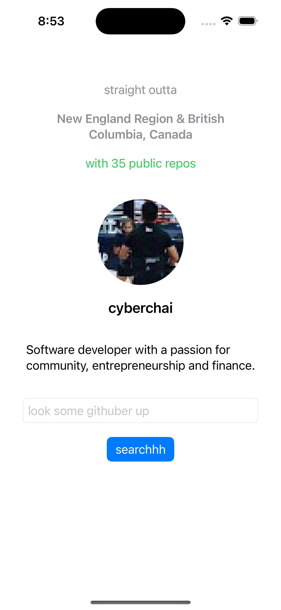

# Gitsta

Gitsta is an iOS app built with SwiftUI that lets you look up GitHub users and view their profile information with randomized taglines.

## Features

- GitHub username search with debounce
- Displays user avatar, bio, location, public repo count, more
- Randomized taglines on each search
- Async image loading with SwiftUI's `AsyncImage`
- Uses GitHub's public REST API

## Screenshots

## Technologies

- SwiftUI
- Combine
- GitHub REST API
- Async/Await (iOS 15+)
